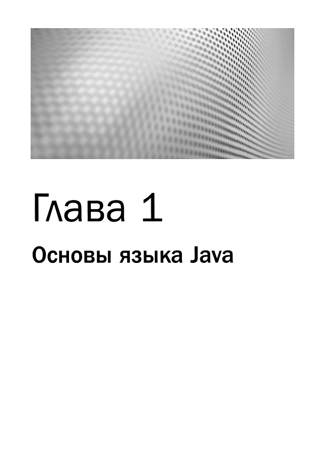

# Java: руководство для начинающих, 9-е издание
*Герберт Шилдт (2023)*

---

## 📘 Глава 1. Основы языка Java

- 📂 Решения в папке: `com.javabeginnersguide.chapter01`
- 📄 Упражнения из книги:
    - Стр. 43–48 — Первая простая программа
    - Стр. 49–51 — Вторая простая программа
    - Стр. 51–53 — Другие типы данных
    - Стр. 54–57 — Два управляющих оператора
    - Стр. 57–58 — Создание блоков кода
    - Стр. 59–61 — Практика отступов
    - Стр. 63 — Вопросы и упражнения для самопроверки

---

## 📘 Глава 2. Введение в типы данных и операции

- 📂 Решения в папке: `com.javabeginnersguide.chapter02`
- 📄 Упражнения из книги:
    - Стр. 67–71 — Примитивные типы Java
    - Стр. 71–73 — Тип `boolean`
    - Стр. 73–76 — Литералы
    - Стр. 76–78 — Подробный анализ переменных
    - Стр. 78–80 — Область видимости и время жизни переменных
    - Стр. 81–83 — Арифметические операции
    - Стр. 83–85 — Операции отношения и логические операции
    - Стр. 85–86 — Короткозамкнутые логические операции
    - Стр. 86–87 — Операция присваивания

