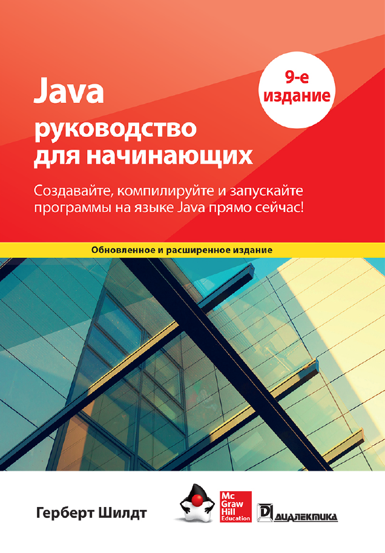
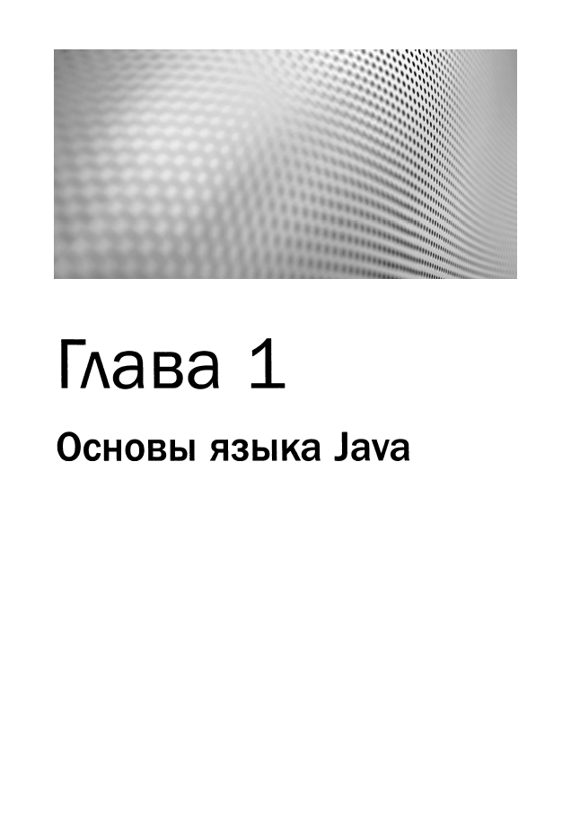
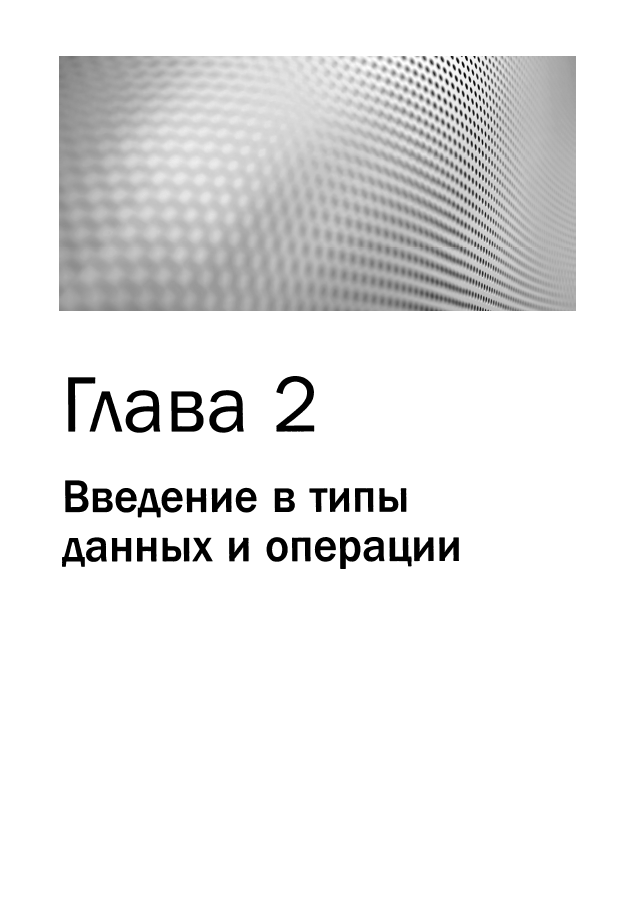
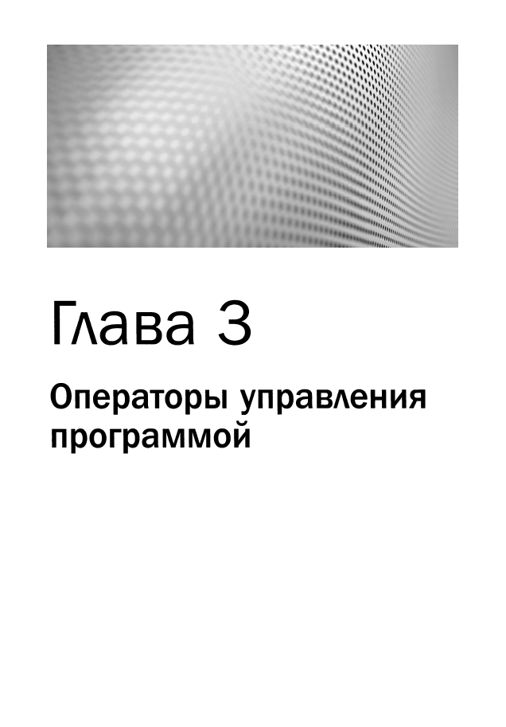

# Java: руководство для начинающих, 9-е издание
*Герберт Шилдт (2023)*

---

## 📘 Глава 1. Основы языка Java

- 📂 Решения в папке: `com.javabeginnersguide.chapter01`
- 📄 Упражнения из книги:
    - Стр. 43–48 — Первая простая программа
    - Стр. 49–51 — Вторая простая программа
    - Стр. 51–53 — Другие типы данных
    - Стр. 54–57 — Два управляющих оператора
    - Стр. 57–58 — Создание блоков кода
    - Стр. 59–61 — Практика отступов
    - Стр. 63 — Вопросы и упражнения для самопроверки

---

## 📘 Глава 2. Введение в типы данных и операции

- 📂 Решения в папке: `com.javabeginnersguide.chapter02`
- 📄 Упражнения из книги:
    - Стр. 67–71 — Примитивные типы Java
    - Стр. 71–73 — Тип `boolean`
    - Стр. 73–76 — Литералы
    - Стр. 76–78 — Подробный анализ переменных
    - Стр. 78–80 — Область видимости и время жизни переменных
    - Стр. 81–83 — Арифметические операции
    - Стр. 83–85 — Операции отношения и логические операции
    - Стр. 85–86 — Короткозамкнутые логические операции
    - Стр. 86–87 — Операция присваивания
    - Стр. 88–90 — Преобразование типов при присваивании
    - Стр. 90–91 — Приведение несовместимых типов
    - Стр. 91–93 — Старшинство операций
    - Стр. 93–96 — Выражения
    - Стр. 96 — Вопросы и упражнения для самопроверки

---

## 📘 Глава 3. Операторы управления программой

- 📂 Решения в папке: `com.javabeginnersguide.chapter03`
- 📄 Упражнения из книги:
    - Стр. 98–99 — Ввод символов с клавиатуры
    - Стр. 100–101 — Оператор `if`
    - Стр. 101–102 — Вложенные операторы `if`
    - Стр. 102–103 — Цепочка `if-else-if`
    - Стр. 103–109 — Традиционный оператор `switch`
    - Стр. 109–111 — Цикл `for`
    - Стр. 111–112 — Некоторые разновидности цикла `for`
    - Стр. 112–113 — Пропуск частей
    - Стр. 113–114 — Циклы без тела
    - Стр. 114–115 — Объявление переменных управления циклом внутри цикла `for`
    - Стр. 115–116 — Цикл `while`
    - Стр. 116–121 — Цикл `do-while`

