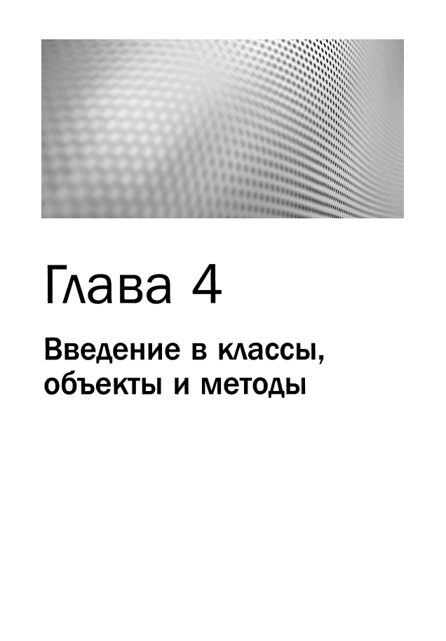
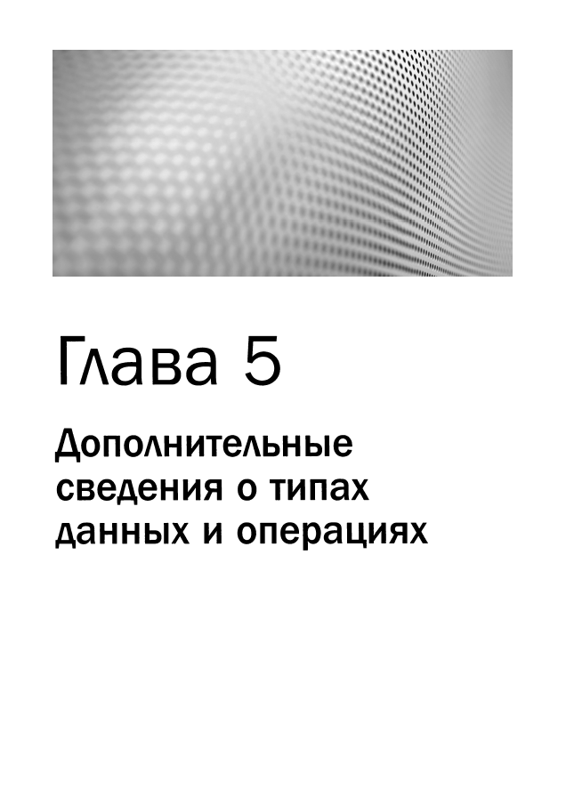
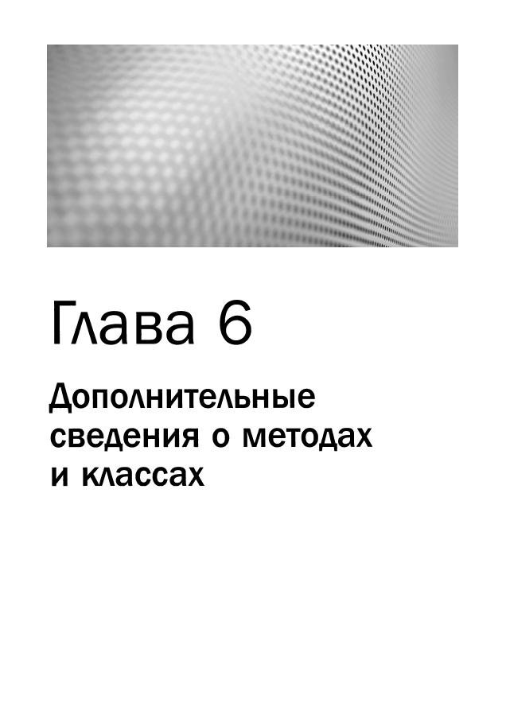

# Java: руководство для начинающих, 9-е издание
*Герберт Шилдт (2023)*

---

## 📘 Глава 1. Основы языка Java

- 📂 Решения в папке: `chapter01`
- 📄 Упражнения из книги:
    - Стр. 43–48 — Первая простая программа
    - Стр. 49–51 — Вторая простая программа
    - Стр. 51–53 — Другие типы данных
    - Стр. 54–57 — Два управляющих оператора
    - Стр. 57–58 — Создание блоков кода
    - Стр. 59–61 — Практика отступов
    - Стр. 63 — Вопросы и упражнения для самопроверки

---

## 📘 Глава 2. Введение в типы данных и операции

- 📂 Решения в папке: `chapter02`
- 📄 Упражнения из книги:
    - Стр. 67–71 — Примитивные типы Java 
    - Стр. 71–73 — Тип `boolean`
    - Стр. 73–76 — Литералы 
    - Стр. 76–78 — Подробный анализ переменных 
    - Стр. 78–80 — Область видимости и время жизни переменных 
    - Стр. 81–83 — Арифметические операции 
    - Стр. 83–85 — Операции отношения и логические операции 
    - Стр. 85–86 — Короткозамкнутые логические операции 
    - Стр. 86–87 — Операция присваивания 
    - Стр. 88–90 — Преобразование типов при присваивании 
    - Стр. 90–91 — Приведение несовместимых типов 
    - Стр. 91–93 — Старшинство операций 
    - Стр. 93–96 — Выражения 
    - Стр. 96 — Вопросы и упражнения для самопроверки

---

## 📘 Глава 3. Операторы управления программой

- 📂 Решения в папке: `chapter03`
- 📄 Упражнения из книги:
    - Стр. 98–99 — Ввод символов с клавиатуры
    - Стр. 100–101 — Оператор `if`
    - Стр. 101–102 — Вложенные операторы `if`
    - Стр. 102–103 — Цепочка `if-else-if`
    - Стр. 103–109 — Традиционный оператор `switch`
    - Стр. 109–111 — Цикл `for`
    - Стр. 111–112 — Некоторые разновидности цикла `for`
    - Стр. 112–113 — Пропуск частей
    - Стр. 113–114 — Циклы без тела
    - Стр. 114–115 — Объявление переменных управления циклом внутри цикла `for`
    - Стр. 115–116 — Цикл `while`
    - Стр. 116–121 — Цикл `do-while`
    - Стр. 121–123 — Использование оператора `break` для выхода из цикла
    - Стр. 123–127 — Использование оператора `break` как разновидности перехода в стиле "goto"
    - Стр. 127–132 — Использование оператора `continue`
    - Стр. 132–133 — Вложенные циклы
    - Стр. 133–134 — Вопросы и упражнения для самопроверки

---

## 📘 Глава 4. Введение в классы, объекты и методы

- 📂 Решения в папке: `chapter04`
- 📄 Упражнения из книги:
    - Стр. 136–141 — Основы классов
    - Стр. 142–145 — Методы
    - Стр. 146–148 — Возврат значения
    - Стр. 148–156 — Использование параметров
    - Стр. 157–158 — Конструкторы
    - Стр. 158 — Параметризованные конструкторы
    - Стр. 159–160 — Добавление конструктора в класс `Vehicle`
    - Стр. 161–163 — Ключевое слово `this`

---

## 📘 Глава 5. Дополнительные сведения о типах данных и операциях

- 📂 Решения в папке: `chapter05`
- 📄 Упражнения из книги:
    - Стр. 166–172 — Массивы
    - Стр. 172–176 — Многомерные массивы
    - Стр. 176–177 — Присваивание ссылок на массивы
    - Стр. 177–183 — Использование члена массива `length`
    - Стр. 183–188 — Цикл `for` в стиле "for-each"
    - Стр. 188–197 — Строки
    - Стр. 197–202 — Использование выведения типов для локальных переменных
    - Стр. 203–212 — Побитовые операции
    - Стр. 213–214 — Операция `?`
    - Стр. 214–216 — Вопросы и упражнения для самопроверки

---

## 📘 Глава 6. Дополнительные сведения о методах и классах

- 📂 Решения в папке: `chapter06`
- 📄 Упражнения из книги:
    - Стр. 218–224 — Управление доступом к членам класса
    - Стр. 225–228 — Передача объектов методам
    - Стр. 228–230 — Возвращение объектов

